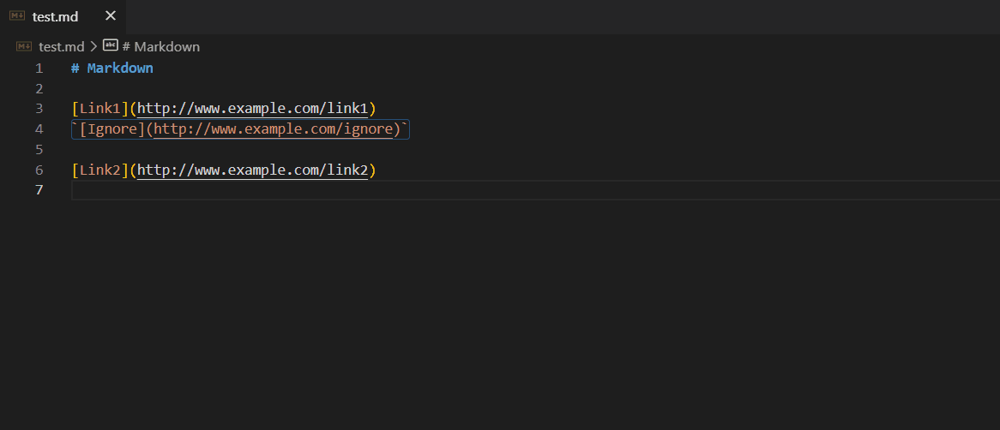

# VSCode Md Footer
VSCode extension for generating markdown footer links via command.
This extension uses [md-footer](https://github.com/sayanarijit/md-footer) rewritten by typescript.

# Demo

# How to generate
Execute command `VSCode Md Footer: Generate Footer` with opening markdown file.
